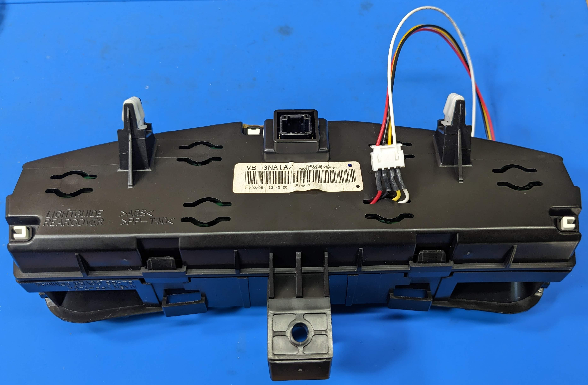
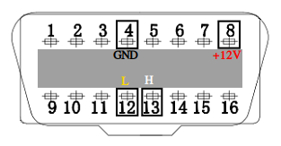

# leaf-energy-meter

The Nissan Leaf Energy Meter displays kWh remaining battery energy using data from the Nissan Leafs EV CAN bus.

Display installed in dash
<p align="center">
  

Display explaination
<p align="center">
  

Total energy is calculated from remaining energy and state of cahrge CAN bus data:

```total energy capacity = remaining energy / state of charge```

Note: total energy capacity does fluctuate a small amount while driving.


Display fully enclosed in 2011-2012 Nissan Leaf Upper Speedometer Combination Meter Display 24810-3NA1A
<p align="center">
  

Wires fed through back 
<p align="center">
  

Black painters tape is used to cover the "christmas" tree efficiency indicator
<p align="center">
  

Display and bezel mounted with Kapton tape
<p align="center">
  

Soldering wires to OLED display 
<p align="center">
  

Meter PCB in case
<p align="center">
  

Code is using arduino
https://www.arduino.cc

<p align="center">
  

The schematics and pcb layout were made using diptrace. Files in ```pcb``` folder
https://diptrace.com

<p align="center">
  

### Parts list

| approx. cost each | description | image |
| :---:   | :---: | :---: |
| $5 | Pro Mini Atmega328P 5V 16MHz for Arduino|  |
| $2 | Mini360 MP1584EN 5V Regulator, DC 5-30V to 5V 1.8A Output Buck Converter Board |  |
| $4 | MCP2515 CAN Bus Module TJA1050 Receiver SPI Module for Arduino |  |
| $7 | SSD1306 0.96" 128X64 OLED Display I2C Font Color White |  |
| $0.5 | JST XH 2.54 4 Pin Connector Plug Male with 200mm Wire & Female Connector |  |
| $8 | OBDII Male Connector with enclosure |  |

The pcb is shared on OSH Park
https://oshpark.com/projects/Czkf2fi5/view_design

<p align="center">
  


### Wiring to OBDII connector
- pin 4, chassis ground
- pin 8, +12V DC when vehicle is powered is on
- pin 12, EV-CAN low
- pin 13, EV-CAN high

<p align="center">
  


bezel is design using OpenSCAD. Files in ```bezel``` folder
https://openscad.org/

<p align="center">
  

